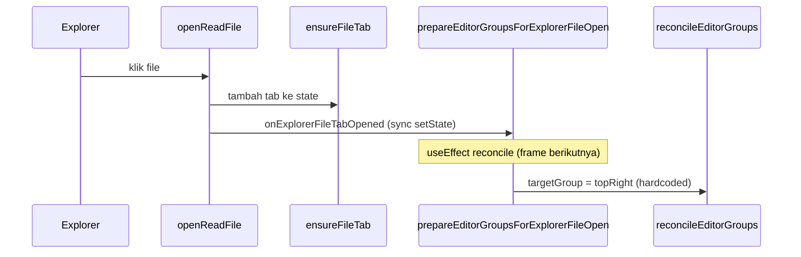

# Perbaiki Explorer → Empty Editor Group

## Masalah saat ini

Alur buka file dari Explorer:



[`targetGroupForNewExplorerFileTab`](apps/web/src/pages/workspace/explorerFileTabPlacement.ts) selalu return `"topRight"` di desktop — abaikan column kosong (`bottomLeft`, `bottomRight`). Akibatnya file dari Explorer selalu append ke topRight meski ada group kosong di kanan.

Sudah ada infra yang benar tapi belum dipakai untuk Explorer:
- [`firstEmptyColumnToTheRight`](apps/web/src/pages/workspace/editorColumns.ts) — dipakai `splitActiveTab` / pane split drop
- [`prepareEditorGroupsForExplorerFileOpen`](apps/web/src/pages/workspace/prepareEditorGroupsForExplorerFileOpen.ts) — sync placement (WIP di branch)
- [`WorkspacePageContent`](apps/web/src/pages/WorkspacePageContent.tsx) — wiring `prepareExplorerFileOpenRef` (WIP)

Bug tambahan di `prepareEditorGroupsForExplorerFileOpen`: cek `alreadyPlaced` hanya lihat `topRight`, bukan semua quadrant.

## Perilaku target (spesifikasi)

| Kondisi layout | Target group | Layout setelah open |
|---|---|---|
| Single, topLeft ada tab | `firstEmptyColumnToTheRight(groups, "topLeft")` → topRight | `horizontal` |
| Horizontal 2 col penuh, bottomLeft kosong | bottomLeft | `horizontal` (3 col) |
| Horizontal 3 col penuh, bottomRight kosong | bottomRight | `horizontal` (4 col) |
| Semua 4 column penuh | **Fallback: append topRight** | `horizontal` |
| Mobile (`allowExplorerFileSplit: false`) | topLeft (active column) | `single` |
| File sudah ada di quadrant manapun | no-op (state unchanged) | — |

Fallback topRight selaras konvensi "kolom file" existing dan `destinationForPaneSplit(..., "right")` dari topLeft.

## Perubahan kode

### 1. Core placement — [`explorerFileTabPlacement.ts`](apps/web/src/pages/workspace/explorerFileTabPlacement.ts)

Update `targetGroupForNewExplorerFileTab`:

```typescript
import { firstEmptyColumnToTheRight } from "./editorColumns";

export function targetGroupForNewExplorerFileTab(state, options?) {
  if (options?.allowExplorerFileSplit === false) return "topLeft";

  const empty = firstEmptyColumnToTheRight(state.groups, "topLeft");
  if (empty) return empty;

  return "topRight"; // fallback: semua column penuh
}
```

`layoutAfterPlacingNewFileTab` sudah benar: non-`topLeft` target dari single → enable horizontal; split existing → preserve layout.

### 2. Sync guard — [`prepareEditorGroupsForExplorerFileOpen.ts`](apps/web/src/pages/workspace/prepareEditorGroupsForExplorerFileOpen.ts)

Ganti `alreadyPlaced` dari cek `topRight`-only ke scan semua quadrant (reuse `findTabQuadrant` dari `editorGroups.ts`):

```typescript
const alreadyPlaced =
  state.layout !== "single"
  && findTabQuadrant(state, filePath) !== null;
```

### 3. Wiring — [`WorkspacePageContent.tsx`](apps/web/src/pages/WorkspacePageContent.tsx)

Tidak perlu logic placement baru; pastikan wiring WIP tetap benar:

- `prepareExplorerFileOpenRef` → `prepareEditorGroupsForExplorerFileOpen({ allowExplorerFileSplit: desktopLayout })`
- `sourceTabsRef` untuk hindari stale closure
- `pendingExplorerFileTabIdsRef` + `reconcileEditorGroups` di `useEffect([sourceTabs])` sebagai follow-up

Verifikasi tidak ada double-placement atau race: sync call + reconcile harus idempotent untuk file yang sama.

### 4. Tests (TDD, vertical slices)

**[`explorerFileTabPlacement.test.ts`](apps/web/src/pages/workspace/explorerFileTabPlacement.test.ts)** — update + tambah:
- 2 col penuh → target `bottomLeft`
- 4 col penuh → target `topRight` (fallback)
- Mobile tetap `topLeft`

**[`prepareEditorGroupsForExplorerFileOpen.test.ts`](apps/web/src/pages/workspace/prepareEditorGroupsForExplorerFileOpen.test.ts)** — tambah:
- 2 col penuh → file di column kosong ke-3
- File sudah di bottomLeft → no-op (bukan re-place ke topRight)
- 4 col penuh → append topRight

**[`explorerFileTabPlacement.test.ts`](apps/web/src/pages/workspace/explorerFileTabPlacement.test.ts) / [`editorGroups.test.ts`](apps/web/src/pages/workspace/editorGroups.test.ts)** — update test lama "always targets topRight when already split" → expect bottomLeft saat topRight occupied tapi bottomLeft kosong.

Jalankan:
```bash
bun run --filter @codesymphony/web test -- explorerFileTabPlacement prepareEditorGroupsForExplorerFileOpen editorGroups
```

## Verifikasi manual

Prasyarat: `bun run dev`, desktop viewport lebar (>768px).

1. **First open (single → split)**
   - Buka workspace dengan chat thread aktif (single pane)
   - Klik file di Explorer
   - Expect: horizontal split, chat kiri, file kanan, tidak ada flash full-width 1 frame

2. **Empty third column**
   - Split manual atau buka terminal di topRight sehingga 2 column penuh
   - Klik file baru di Explorer
   - Expect: file muncul di column ke-3 (bottomLeft slot), bukan tab baru di topRight

3. **Fallback 4 column penuh**
   - Isi 4 column (chat + terminal + 2 file, atau kombinasi serupa)
   - Klik file baru di Explorer
   - Expect: tab append di topRight group, file aktif di topRight

4. **Re-click file yang sudah terbuka**
   - Klik file yang sudah ada di bottomLeft
   - Expect: tidak duplikat tab, focus pindah ke tab existing

5. **Mobile**
   - Resize ke mobile / `allowExplorerFileSplit: false`
   - Klik file di Explorer
   - Expect: single pane, file tab di topLeft bersama tab lain

6. **Quick file picker (regression)**
   - Cmd+P buka file
   - Expect: placement tetap benar (bukan explorer path, tapi pastikan reconcile tidak rusak)

## File yang disentuh

| File | Peran |
|---|---|
| [`explorerFileTabPlacement.ts`](apps/web/src/pages/workspace/explorerFileTabPlacement.ts) | Logic target column + layout |
| [`explorerFileTabPlacement.test.ts`](apps/web/src/pages/workspace/explorerFileTabPlacement.test.ts) | Unit test placement |
| [`prepareEditorGroupsForExplorerFileOpen.ts`](apps/web/src/pages/workspace/prepareEditorGroupsForExplorerFileOpen.ts) | Sync placement + fix alreadyPlaced |
| [`prepareEditorGroupsForExplorerFileOpen.test.ts`](apps/web/src/pages/workspace/prepareEditorGroupsForExplorerFileOpen.test.ts) | Unit test sync path |
| [`WorkspacePageContent.tsx`](apps/web/src/pages/WorkspacePageContent.tsx) | Verifikasi wiring (minimal/no-op jika sudah benar) |
| [`editorGroups.test.ts`](apps/web/src/pages/workspace/editorGroups.test.ts) | Update reconcile integration test jika perlu |

Tidak perlu ubah [`useWorkspaceFileEditor.ts`](apps/web/src/pages/workspace/hooks/useWorkspaceFileEditor.ts) — callback `onExplorerFileTabOpened` sudah dipanggil dari `openReadFile` saat `openedNewTab`.
